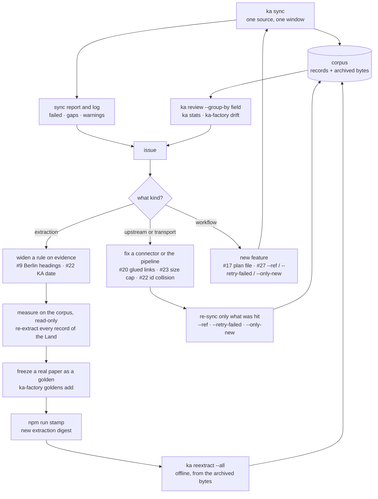

# Developing openka-cli

This repository implements [CONCEPT.md](CONCEPT.md) in TypeScript. Read the concept
first: it explains *why* the architecture looks like this. This file explains what
is actually here, where the judgement calls live, and what is deliberately absent.

## Commands

```bash
npm install         # links the workspace packages
npm run build       # tsc -b: every package, in dependency order
npm run typecheck   # the same build; with project references there is no --noEmit
npm test            # every package's suite, then the integration suite
npm run coverage    # the same, with a hard 80% floor on lines and functions
npm start           # runs `ka` from the build
npm run lint:line   # the no-generative-model guardrail
npm run stamp       # re-freeze the extraction digest after changing extraction code
```

**Coverage has a floor, not a target.** `npm run coverage` fails the build below 80%
of lines or functions, measured across the whole workspace in one run — because
packages exercise each other and measuring one in isolation understates it. Every
package is above the floor; the workspace sits at ~94% of lines and ~93% of
functions.

**Releasing bumps the published package, not the root.** The root is
`openka-workspace` and `"private": true` — npm refuses to publish it, which matters
because a root pack carries every package's sources, tests and fixture PDFs (it was
published once by mistake, and unpublished; a test in `cli-ka-factory` keeps the flag
set). `npm version patch` there moves a version nobody
ships and leaves the tag pointing at the wrong number. Use
`npm version --workspace @maschinenlesbar.org/openka-cli patch --no-git-tag-version`
(then commit "X.Y.Z" and tag `vX.Y.Z` by hand), and check the root `package.json` is
still `0.1.0` before committing: npm 11.19 without `--no-git-tag-version` also bumped
the root and committed and tagged it as "0.1.1" during the 0.3.1 release. Pack with
`npm run pack` so the prepack/postpack pair runs. `release.yml` and `publish.yml`
read the version from `packages/openka-cli/package.json` for the same reason, and a
test in `cli-ka-factory` fails if a workflow goes back to reading the root's. The
bump also has to reach `PACKAGE_VERSION` in `packages/lib-repro/src/version.ts` — a
literal, because the line reads no manifest at run time — which is what `ka --version` prints and `extractor_version` stamps. The published package's `version`
lifecycle script (`tools/version.mjs`) rewrites and stages it during `npm version`,
and a test in `lib-repro` fails if the two ever disagree.

**The README npm shows is the repository's** (prepack swaps it in), so a relative link
in it must point to a document the tarball carries — `LICENSE`, `LICENSING.md`,
`CONTRIBUTING.md`, `DATA_LICENSE.md`, `CONCEPT.md`; anything else (DEVELOPING.md, a
package README) is linked by its absolute GitHub URL, or it is dead on npmjs.com.
`packages/openka-cli/test/readme-links.test.ts` checks every relative link against the
package's `files` and prepack's document list (P21 of the 2026-10-06 follow-up round).

**The first publish is local; every one after it is `publish.yml`.** npm Trusted
Publishing can only be configured for a package that already exists, so the first
version goes up from a maintainer's machine, from a clean checkout of its tag:
`npm publish --workspace @maschinenlesbar.org/openka-cli --access public` — the
command `npm run publish:npm` runs, too. It passes no `--provenance`: under npm
Trusted Publishing `publish.yml` gets the provenance attestation without the flag,
and the flag only made a local publish fail. Then set the trusted publisher on
npmjs.com (this repository, workflow `publish.yml`), and later versions go tag →
`release.yml` → dispatch `publish.yml` from the tag
(`gh workflow run publish.yml --ref vX.Y.Z`, which takes the version from the tag),
like every other repository in the workspace.

One package: `npm test -w @maschinenlesbar.org/openka-lib-pdf`. One test file:
`node --test packages/lib-pdf/dist/test/pdf.test.js`. The CLI from source:
`node packages/cli-ka/dist/src/index.js --help`.

## The two planes, as packages

The repository is an npm workspace. One `tsc -b` graph, one published package, and
the line/factory split is a package boundary rather than a convention.

```
packages/
  lib-errors/            the error hierarchy
  lib-text/              control-character stripping and text normalisation
  lib-repro/             canonical JSON, hashing, the extractor version stamp
  lib-models/            canonical schema, validators, JSON Schema, the 17 parliaments
  lib-http/              Transport seam + fetch engine (retry, redirects, conditional)
  lib-pdf/               a dependency-free PDF reader: lexer, filters, fonts, text
  lib-perceive/          the Perceiver seam — the one place a model may run
  lib-extract/           the tier stack, the frozen segmentation rules, the validators
  lib-store/             the corpus: blobs, records, catalog, inverted index
  lib-search/            keyword search and the frozen-embedding path
  lib-render/            JSON, JSON-LD, CSV, Markdown, Atom
  lib-verify/            re-extract an archived record and compare — `ka verify`
  lib-pipeline/          discover → fetch → extract → normalize → store
  lib-source/            the Source seam and the scraping helpers connectors share
  lib-pardok/            the PARDOK `Parlamentsspiegel Export 1.0` reader
  lib-parlamentsspiegel/ the shared aggregator adapter
  lib-registry/          collects every connector's ENTRY; depends on all 17
  lib-testing/           shared test helpers (private, never shipped on the line)
  connector-bund/        the Bundestag, and one package per Bundesland:
  connector-berlin/ … connector-thueringen/
  cli-ka/                `ka`
  cli-ka-factory/        THE FACTORY — build-time only, never imported by the line
src/index.ts             the library entry point: the line's public surface
test/                    the cross-package integration suite
```

**Every package has a README** — what it does, its public surface, what it depends on
and why, the tests it runs and the fixtures it holds. That folder is meant to be
enough on its own; this file is the map between them. Each package builds to its own
`dist/src` and `dist/test`, and keeps its own tests and fixtures beside its code. Everything except `openka-cli` is `private`; it bundles them into a single published
tarball with both bins. That bundling needs `tools/prepack.mjs` — npm bundles
`bundleDependencies` from a package's *own* `node_modules`, and in a workspace they
are symlinked into the root's instead, so packing without it yields a tarball with
no dependencies and bins that resolve nothing. Its README explains the rest.

**Why `lib-verify` is not part of `lib-repro`.** Verification re-runs extraction over
archived bytes, so it needs `lib-extract` and `lib-store` — while `lib-extract`
needs `lib-repro` for the version stamp. In one package that is a cycle. Splitting
the primitive (hash, canonical JSON, stamp) from the service (re-extract and
compare) breaks it, and the dependency graph has been acyclic since.

**Two TypeScript projects per package**: `tsconfig.json` for `src/`, referenced by
other packages, and `tsconfig.test.json` for `test/`, referenced by nothing. Without
that split, `lib-store`'s tests using `lib-testing` — which itself depends on
`lib-store` — is a reference cycle and `tsc -b` refuses to build.

`ka-factory lint` enforces the boundary: nothing in any package except
`cli-ka-factory` may import an LLM client, mention a model provider's host, or import
the factory. The roots are discovered from `packages/` rather than listed, so a new
connector is covered the moment it exists — and since the published entry point is a
package now, the lint has no path to special-case either. It runs in CI on every
push.

## Package index

| package | |
|---|---|
| [`cli-ka-factory`](packages/cli-ka-factory/README.md) | `ka-factory` — build-time tooling, deliberately unreachable from the line. |
| [`cli-ka`](packages/cli-ka/README.md) | `ka` — the read/write CLI over a corpus. |
| [`connector-baden-wuerttemberg`](packages/connector-baden-wuerttemberg/README.md) | Landtag Baden-Württemberg — reachable today, no adapter of its own yet. |
| [`connector-bayern`](packages/connector-bayern/README.md) | The Landtag's own Anfragen feed, plus the static Drucksachen it files them under. |
| [`connector-berlin`](packages/connector-berlin/README.md) | Berlin publishes its parliamentary documentation as open data — the only Land that does. |
| [`connector-brandenburg`](packages/connector-brandenburg/README.md) | Public documents, a blanket robots.txt, and the operator's call. |
| [`connector-bremen`](packages/connector-bremen/README.md) | The Bürgerschaft's own PARiS, with the aggregator only behind it. |
| [`connector-bund`](packages/connector-bund/README.md) | The Bundestag, through DIP — the cleanest source in the project. |
| [`connector-hamburg`](packages/connector-hamburg/README.md) | Hamburgische Bürgerschaft — reachable today, no adapter of its own yet. |
| [`connector-hessen`](packages/connector-hessen/README.md) | Hessischer Landtag — reachable today, no adapter of its own yet. |
| [`connector-mecklenburg-vorpommern`](packages/connector-mecklenburg-vorpommern/README.md) | The Landtag's own Parlamentsdokumentation, with the aggregator only behind it. |
| [`connector-niedersachsen`](packages/connector-niedersachsen/README.md) | The Land where the answer is a different Drucksache and nothing links the two. |
| [`connector-nordrhein-westfalen`](packages/connector-nordrhein-westfalen/README.md) | The largest Landtag, and the one that runs the Parlamentsspiegel for all sixteen. |
| [`connector-rheinland-pfalz`](packages/connector-rheinland-pfalz/README.md) | Landtag Rheinland-Pfalz — reachable today, no adapter of its own yet. |
| [`connector-saarland`](packages/connector-saarland/README.md) | A Land that looked like a source of scanned PDFs, and was not. |
| [`connector-sachsen-anhalt`](packages/connector-sachsen-anhalt/README.md) | Public documents, a malformed robots.txt, and the operator's call. |
| [`connector-sachsen`](packages/connector-sachsen/README.md) | Documents behind EDAS, a frameset viewer. |
| [`connector-schleswig-holstein`](packages/connector-schleswig-holstein/README.md) | Schleswig-Holsteinischer Landtag — reachable today, no adapter of its own yet. |
| [`connector-thueringen`](packages/connector-thueringen/README.md) | The Landtag's own Parlamentsdokumentation, with the aggregator only behind it. |
| [`lib-errors`](packages/lib-errors/README.md) | The error types the whole project throws. |
| [`lib-extract`](packages/lib-extract/README.md) | The deterministic tier stack, the frozen segmentation rules, and the last gate before a record is published. |
| [`lib-http`](packages/lib-http/README.md) | Every HTTP request the project makes, and the rules it makes them under. |
| [`lib-models`](packages/lib-models/README.md) | The canonical record — the standardized format at the heart of the project. |
| [`lib-pardok`](packages/lib-pardok/README.md) | The `Parlamentsspiegel Export 1.0` XML format. |
| [`lib-parlamentsspiegel`](packages/lib-parlamentsspiegel/README.md) | The Länder's shared research portal — and the fallback for every Land without an adapter. |
| [`lib-parldok`](packages/lib-parldok/README.md) | Parldok — the parliamentary documentation system several Landtage run. |
| [`lib-pdf`](packages/lib-pdf/README.md) | A PDF reader written from scratch, because the alternative was a dependency that guesses. |
| [`lib-perceive`](packages/lib-perceive/README.md) | The only place a trained model may run on the line. |
| [`lib-pipeline`](packages/lib-pipeline/README.md) | discover → fetch → extract → normalize → store. |
| [`lib-registry`](packages/lib-registry/README.md) | Every parliament OpenKA covers, and the honest state of its adapter. |
| [`lib-render`](packages/lib-render/README.md) | Renderings of the one canonical record: JSON, JSON-LD, CSV, Markdown and Atom. |
| [`lib-repro`](packages/lib-repro/README.md) | The byte-level foundation of the reproducibility guarantee. |
| [`lib-robots`](packages/lib-robots/README.md) | robots.txt, parsed and applied (RFC 9309). |
| [`lib-search`](packages/lib-search/README.md) | Keyword search over the index, and semantic search over vectors the factory froze. |
| [`lib-source`](packages/lib-source/README.md) | The `Source` protocol, and the scraping helpers the connectors share. |
| [`lib-starweb`](packages/lib-starweb/README.md) | STARWEB — a stateful HTML form, not an API. |
| [`lib-store`](packages/lib-store/README.md) | The corpus: content-addressed blobs, canonical records, a catalog and an inverted index. |
| [`lib-testing`](packages/lib-testing/README.md) | The seams, pre-wired: an in-memory store, a scripted transport, and fixture access. |
| [`lib-text`](packages/lib-text/README.md) | One implementation of text hygiene, with three intentions. |
| [`lib-verify`](packages/lib-verify/README.md) | Proving reproducibility on demand. |
| [`openka-cli`](packages/openka-cli/README.md) | The published package: the library entry point and the two bins. |

## The seams

Three injection points make the whole program testable in-process. No test spawns
a subprocess, touches the network, or reads the clock.

- **`Transport`** (`lib-http`) — one
  `(HttpRequest) => Promise<HttpResponse>` function. Tests inject a scripted one.
- **`Store`** (`lib-store`) — the corpus. `FileStore` is the real
  implementation; `MemoryStore` in `test/helpers.ts` is the test double.
- **`CliDeps`** (`src/cli/io.ts`) — I/O, the store factories (`createStore` for a
  command that writes, `openStore` for one that only reads an existing corpus), the
  engine factory, the environment, **the clock**, the volume probe (`volumes`:
  filesystem and free space) and `sleep` (only `ka status --watch` waits). `run()` returns an exit code rather than calling
  `process.exit`.

A fourth, narrower one: **`Perceiver`** (`lib-perceive`), the only
place a trained model may run at execution time.

## The library validates its own inputs

Every rule about what a caller may pass lives in the library, not in a `ka` value
parser, so the published entry gives a library caller the same answer the CLI gives.
A rule is a pure `Problem` function (`(value) => reason | undefined`, in the package
that owns the concept); the library function calls `assertValid(name, value,
problem)` from `lib-errors` before it fetches, writes or reads anything, and the CLI's
commander parser calls the same `Problem` and turns its reason into an
`InvalidArgumentError`. The library throws **`OpenKaValidationError`** (a
`UsageError`, message `Invalid <name>: <reason>`); a promise-returning function
rejects rather than throwing synchronously. Both `run()` and `runFactory()` map it to
exit 2, printed as `Error: <message>`.

`packages/cli-ka/test/helpers.ts` has the `parity()` helper: one input through
`run()`/`runFactory()` and through the library call, on one recording transport and
identically seeded corpora. Every such rule gets a parity test in
`packages/cli-ka/test/parity.test.ts`.

What the library rejects with `OpenKaValidationError`, so far:

- **A blank OCR option** — `language`, `requireVersion` or `traineddataPath` given as
  `""` or whitespace to `TesseractCliPerceiver` / `TesseractJsPerceiver`
  (`assertPerceiverOptions`, `lib-perceive`). An omitted one still means the default.
- **Blank or unsafe factory parameters** — `addGolden` refuses a blank `root` or
  `note` and a `source` that is not a safe key (`goldenKeyProblem`: blank, `..`,
  upper case); `importEmbeddings` a blank `model` and a `modelSha256` that is not 64
  hex digits (`modelSha256Problem`); `loadBaseline`/`saveBaseline` a blank path or
  one that is not a string (`baselinePathProblem`). The
  `ka-factory` options `--source` and `--model-sha256` use the same rules, so
  `goldens add --source ..` and `embed --model-sha256 abc` are now usage errors too.
- **A malformed record id or an unknown source key** — every `FileStore` method that
  takes a record id (`getRecord`, `getRecordBytes`, `hasRecord`, `deleteRecord`, so
  also `verifyRecord`, `archivedDocument`, `markHumanVerified`) runs `assertRecordId`
  first (`recordIdProblem`, `RECORD_ID_REASON`, `lib-store`): "BERLIN-19-10006" or
  "../x" is `Invalid id: Not a record id: …`, where it used to be a `StoreError`
  ("the corpus is damaged", exit 3 for a library caller's own mistake). An unsafe
  record file name found *inside* the corpus stays a `StoreError`, now raised by
  `recordIds()`. `createSource(key)` (`lib-registry`) refuses a blank or unknown key
  (`sourceKeyProblem`: `Invalid source: Unknown source "narnia". Known sources: …`)
  where it threw a plain `Error`; a registered key with no adapter is an
  `OpenKaError`. `ka`'s `<id>` arguments and `sync --source` are these rules as
  parsers, with their messages unchanged, and `ka sync` lost its second, unreachable
  copy of the source check.
- **An embedding size the factory cannot build** — `buildEmbeddings` refuses a
  `dimensions` that is not an integer in 16–4096 (`dimensionsProblem`,
  `MIN_DIMENSIONS`, `MAX_DIMENSIONS`); 0 used to build a set of empty vectors that
  `ka search --like` then served. `ka-factory embed --dimensions` uses the constants.
- **An answer sweep that cannot be read** — `sweepAnswers` runs `assertSweepRange`
  before it fetches or writes: `period` in 1–99 (`SWEEP_PERIOD_RANGE`), `from`/`to`
  in 1–999 999 (`DRUCKSACHE_RANGE`), both integers, and `to >= from`. A backwards
  range used to save an empty map claiming that range as swept. `ka-factory answers`
  builds its parsers from the constants; `--to` before `--from` is now a usage error
  (exit 2, `Invalid to: Must be >= from (…).`) rather than exit 1.
- **A lint of nothing** — `lintLine(root)` (factory) refuses a blank root
  (`OpenKaValidationError`) and throws `OpenKaError` ("nothing to lint: no
  packages/*/src under …") when no line source is found, instead of returning a
  clean `{ filesChecked: 0, violations: [] }` that read as a pass. `ka-factory lint`
  used to be the only place that checked.
- **A search filter that cannot match** — `search()`, `searchLike()` and
  `reviewQueue()` run `normalizeSearchFilters` (`lib-search`): an unknown parliament
  (keys are trimmed and case-folded, so `Berlin` works), a blank party, an unknown
  review status, a year outside 1949–2999 or a period outside 1–99 (`YEAR_RANGE`,
  `PERIOD_RANGE`), a date that is not a `YYYY-MM-DD` calendar date (padding is
  trimmed; `isoDateProblem` in `lib-models`). `ka`'s `--parliament`, `--from`/`--to`,
  `--year`/`--period` parsers call the same rules.
- **A query with nothing searchable** — `search()` (and so `selectRecords()`) runs
  `searchableQueryProblem` (`lib-search`) first: a non-blank query with no term left
  after tokenising (`???`, `a`, `-`) is refused instead of answering every record. A
  blank query still means every record, and an exclusion-only one (`-radwege`)
  still works. The check used to sit in the `ka search` action only, so `ka export
  --query` and `ka feed --query` returned every record too; all three now exit 2
  with `Invalid query: Nothing searchable in …`.
- **A page that cannot exist** — `search()`, `searchLike()`, `selectRecords()` and
  `reviewQueue()` run `assertPaging` (`lib-search`): `limit` must be an integer >= 1
  and `offset` an integer >= 0 (`LIMIT_MIN`, `OFFSET_MIN`; `limit` defaults to
  `DEFAULT_SEARCH_LIMIT`). A negative one used to wrap around through `slice`. The
  per-command maxima (`search` 1000, `export` 1 000 000, `feed` 500, `review`
  10 000) stay in `ka`: they are presentation caps.
- **A sync window that cannot be honoured** — `sync()` runs `normalizeSyncWindow`
  (`lib-pipeline`) before it reads source state or sends a request: `since`/`until`
  must be `YYYY-MM-DD` calendar dates (padding is trimmed, so `" 2024-01-01"` reaches
  DIP as `2024-01-01` rather than `%202024-01-01`), `until` not before `since`,
  `period` an integer in `PERIOD_RANGE` (1–99, `lib-models`) and `limit` an integer
  >= `SYNC_LIMIT_MIN`. A refused window is not recorded as a source error. `ka sync`
  builds `--period`/`--limit` from the same bounds; its `--limit` maximum (100 000)
  is a cap of the command. `--until` before `--since` is now exit 2 (`Invalid until:
  Must be >= since (…).`) where it used to sync nothing. The integer rule itself is
  `intRangeProblem` in `lib-errors`, shared with the search filters and the
  factory's sweep.
- **A list of sources that cannot be run** — `syncSources()` refuses an empty list or a
  source named twice (`sourceListProblem`, lib-pipeline) and checks the shared window
  once, before the lock is taken or a request sent. `ka sync --source berlin --source
  berlin` is the same usage error (exit 2, `Invalid sources: "berlin" is named twice.`).
  `syncJobs()` is the general case: jobs with a window each, no label twice
  (`jobListProblem`). A job spec (`bund@period=21`) is read by `parseJobSpec`, and a
  window takes its defaults with `withDefaults`. A plan file is read by
  `parseSyncQueue` (`queue.ts`) through a TOML subset of our own (`toml.ts`), since
  the line takes no dependency for it. All of these are lib-pipeline's; `ka sync`
  (`commands/sync-jobs.ts`) only reads flags into them. A plan's progress is
  `FileStore.getQueueProgress`/`putQueueProgress` (lib-store, `state/queues/`).
- **Engine options out of bounds** — `new FetchEngine(options)` runs
  `assertEngineOptions` (`lib-http`): `timeoutMs` 0–`MAX_TIMEOUT_MS`, `maxRetries`
  0–`MAX_RETRIES` (10), `maxRedirects` 0–`MAX_REDIRECTS` (10), `minHostIntervalMs`
  0–`MAX_HOST_INTERVAL_MS` (60 000), `maxResponseBytes` >= `MIN_RESPONSE_BYTES`
  (1024), all integers, and a `userAgent` that is neither blank nor a broken header
  value (`userAgentProblem`: control characters incl. CR/LF, anything above
  U+00FF). `maxRetries: -1` used to send nothing and fail with "NetworkError:
  undefined"; an over-long timeout used to be clamped silently. `ka`'s global
  options build their parsers from these constants, so `--user-agent` with a
  control character or `€` is now a usage error up front instead of a failed
  request.
- **An unknown render format or a blank feed title or id** — `renderRecord` checks
  the format against `RENDER_FORMATS` (`renderFormatProblem`) instead of falling back
  to JSON; `renderAtom` refuses a blank `title`/`id` and applies
  `DEFAULT_FEED_TITLE`/`DEFAULT_FEED_ID` when they are omitted (`lib-render`).

What the library now computes that a `ka` action used to compute on its own:

- **The export set and the feed's newest entries** — `selectRecords(store, query,
  filters)` (`lib-search`) returns every match (not `search()`'s page of 20) plus the
  ids of catalog rows whose record file is gone; `renderAtom` orders its entries
  newest first itself (`newestFirst`, `lib-render`) and keeps the newest `limit` of
  the whole set. `ka export` and `ka feed` call exactly these.
- **The review queue and the verified mark** — `reviewQueue(store, { parliament,
  limit })` (`lib-search`: abstained, not `human_verified`, most abstentions first)
  and `markHumanVerified(store, id)` (`lib-store`: record *and* catalog row, so
  search and the queue see it). The `onlyAbstained` search filter stays "abstained,
  verified or not". `ka review` calls these.
- **Whether a corpus is there** — `FileStore.open(root)` (`lib-store`) opens an
  existing corpus for reading: a missing directory throws `MissingCorpusError`, a
  path that is not a directory `StoreError` (both exit 3), and nothing is created.
  `new FileStore(root)` stays open-or-create for writers, so on a mistyped path it
  answers an empty corpus. `ka`'s read commands open the corpus through
  `CliDeps.openStore` and only add where the path came from (`Check --corpus /
  OPENKA_CORPUS …`); a path that is a file used to read as an empty corpus there too.
- **Where the corpus is** — `resolveCorpusRoot({ root?, env })` (`lib-store`):
  `root` (the `--corpus` flag), else `$OPENKA_CORPUS`, else `$XDG_DATA_HOME/openka`,
  else `~/.local/share/openka`, each path resolved exactly as given. A blank `root`
  is refused; a blank environment variable counts as unset. The CLI used to trim the
  environment variables but not the flag, so `"corpus "` named two directories
  depending on how it was passed.
- **Whether the catalog and the records agree** — `catalogGaps(store)` (`lib-store`)
  names record files without a catalog row and rows without a file; `corpusStats`
  carries the first as `uncatalogued`, and `ka stats`/`ka verify` print a note. A
  sync killed before its catalog was saved used to leave its records in the first
  group for good, since every later run called them "unchanged"; `sync()` now
  saves the catalog every `CATALOG_CHECKPOINT` refs, stops between refs on an
  `AbortSignal` (`ka sync`'s Ctrl-C), and indexes an unchanged record that has no
  row (`recatalogued` in the report).
- **Who may write a corpus** — `FileStore.lock(purpose)` (`lib-store`) and
  `withCorpusLock`: `sync()`, `reindexAll` and `markHumanVerified` hold `<corpus>/lock`
  while they write, and a second writer gets `CorpusLockedError` (exit 3). Two syncs
  on one corpus used to lose postings and catalog rows while both reported success.
  A lock whose process on this host is gone is taken over. `lockStatus()` reads it
  without taking it (`ka doctor`).
- **Where a credential comes from** — `apiKeyLookup` (`cli-ka`'s `shared.ts`): `--api-key`,
  then the source's environment variable, then the credentials file (`CredentialStore`,
  `lib-store`: `$XDG_CONFIG_HOME/openka/credentials`, mode 0600, atomic, refused when
  others can read it or it lies inside the corpus). `ka config set` reads the value
  through `CliIO.readSecret` — a prompt without echo, or stdin — and never from argv; the
  CLI harness gives every test a config directory of its own, so no test touches the
  user's file.
- **A record that takes over another** — a `DocRef`'s `replaces` (`lib-source`) names
  records it continues, and `formerly` names references it was stored under before.
  `syncRef` (`lib-pipeline`) retires them through `unindexRecord` + `deleteRecord` once
  the new record is stored or found unchanged. A replaced record gives up its
  `dates.submitted` if the new one has none. A former one is removed only when it holds
  the very same documents. Sachsen-Anhalt uses both: a question is `KA 8/NNNN` until
  its answer cites it (issue #22).
- **Holes a parliament never fills** — `Parliament.knownGaps` (`lib-models`) declares a
  field a parliament's publications never carry, with the reason (Sachsen-Anhalt:
  `dates.submitted`). `onlyKnownGaps(parliament, abstained_fields)` is true for a record
  whose every hole is such a field: `reviewQueue`/`reviewGroups` (`lib-search`) leave it
  out unless `includeKnownGaps`, and `corpusStats` (`lib-store`) counts it as
  `known_gaps_only`. The record is not changed — its `abstained_fields` and
  `parse_complete` still say what was not read.
- **What a running sync is doing** — `RunStatusRecorder` (`lib-store`) keeps
  `<corpus>/run/status.json` from `syncJobs`' callbacks, on the CLI's clock, and never
  throws: a status that cannot be written is a warning, not a stopped sync.
  `readRunReport(store, now)` joins it with `lockStatus()` into running / idle / stale /
  busy, with each job's rate over the last `RATE_WINDOW_MS` and its time left. `ka
  status` only renders that.
- **Where a corpus may be written, and how full** — `checkCorpusVolumes` (`lib-store`)
  asks a `VolumeProbe` about the corpus and a separate blob directory: FAT32/exFAT is a
  problem unless allowed, a network filesystem a warning, less than `minFreeBytes`
  (`DEFAULT_MIN_FREE_BYTES`, 1 GB) a problem. `ka sync` runs it before taking the lock
  and refuses on a problem (exit 3). `spaceGuard` is what `sync()` takes as
  `SyncOptions.space`: after discovery it refuses a download that would not fit
  (`corpusEstimate`, the same corpus-average estimate `planSync` uses, no requests), and
  before each ref it stops the run on a volume below the floor (`SyncReport.lowSpace`,
  kept like an interrupted run). `diagnoseCorpus` adds the lock, `catalogGaps`, the blob
  drive and the platform files for `ka doctor`; `removePlatformFiles` is `--fix`.
  `systemVolumes` reads `statfs` for space and the filesystem from `mount` on macOS
  (where statfs's type number is a slot assigned at driver load, not a constant) and
  from statfs's magic number on Linux. `CliDeps.volumes` injects it; the CLI harness
  passes a roomy local disk, so no test depends on the machine's.
- **Which date a record has** — the question's (`dates.submitted`), nothing else:
  the catalog's `year`, `matchesFilters` and the listing use it, a record without it
  is in no `--year`/`--from`/`--to` window, and `search()`/`selectRecords()` count those
  as `undated`. The sync window alone still places a ref that carries only an answer
  date at that date (and `sync()` warns), because a discovery that left such refs out
  would fetch nothing from a combined-paper Land. Bayern's question date is read from
  the paper's head (`readAnfrageHead`, `lib-extract`).
- **The corpus summaries** — `corpusStats(store, { where })` (`lib-store`) is what `ka stats`
  prints — counts, coverage, extractor versions, abstentions by field, over the rows
  `where` keeps — and `statsBreakdown(entries, by)` / `statsSelection(entries, filters)`
  (`lib-search`, since a party is grouped by `partyKey`) its `--by` tables, and `sourceStatus(store, SOURCE_REGISTRY)` (`lib-pipeline`) the table of
  `ka sources list`; the "degraded" label of its text view stays rendering.
- **Where a golden is filed** — `addGolden(store, id, { root?, source?, note? })`
  (factory) defaults `source` to the record's parliament and `root` to
  `goldenRootFor(source)`: the source's connector package `fixtures/`, the directory
  `listAllGoldens` reads. `goldens add` without `--dir` used to resolve the help-text
  placeholder "every package's fixtures/" as a path and file the golden where the
  gate never looked.
- **Where a corpus's drift baseline lives** — `BASELINE_FILE` and
  `baselinePath(corpusRoot)` (factory, `health.ts`): `<corpus>/health-baseline.json`.
  `saveCorpusBaseline`/`loadCorpusBaseline` write and read it there; `health
  --save-baseline` and `drift` without a path use exactly that location. The file
  name used to be a constant of the `ka-factory` program only. `loadBaseline(path)`
  is strict: no file at a path the caller named is an `OpenKaError` ("No baseline at
  …"), where it used to read as a first run; only `loadCorpusBaseline` returns
  `undefined`, for a corpus whose default baseline was never written.
- **A ready OCR engine** — `createPerceiver(mode, { language?, requireVersion?,
  traineddataPath? })` (`lib-perceive`, with `OCR_MODES`) is the setup `ka sync`,
  `ka verify` and `ka-factory goldens verify` used to import from the `ka` package
  (`buildPerceiver`): `off` is strict mode, the engines fail fast with an
  `OpenKaError` when the binary is not on `PATH` or `tesseract.js` will not load,
  and options under `off` are refused (`ka sync` names the flags itself first). The
  OCR tier (`lib-extract`) now awaits a perceiver's optional `load()` before
  `artifact()`, so `verifyRecord` with a plain `new TesseractJsPerceiver()` no
  longer reports a false non-reproduction. Both are extraction code: the digest
  moved and the goldens were re-frozen.
- **Semantic search's total** — `searchLike(store, id, options)` (`lib-search`)
  returns `{ total, hits }` like `search()`, with `total` counted before the page is
  cut; it used to return the bare page, and `ka search --like --json` filled `total`
  with the page length. `ka` prints the library's result unchanged and notes "N of
  M similar record(s)." on stderr, as keyword search does. Library callers that
  used the returned array read `.hits` now.
- **A record's archived document** — `archivedDocument(store, id, { role? })`
  (`lib-store`) picks the first document with archived bytes (with that role, if
  given; `documentRoleProblem` refuses a role no record can have), checks the bytes
  and returns `{ document, path }`; missing and corrupt bytes are both a
  `StoreError`. `blobPath` stays an unchecked path builder, and says so. `ka open`
  prints that path: missing bytes now exit 3 like corrupt ones (they used to exit
  1), and `--role bogus` is a usage error instead of "It was synced with
  --metadata-only".
- **Verifying a corpus** — `verifyCorpus({ store, ids?, all?, limit? })`
  (`lib-verify`) picks the records (given ids, all, or `evenSample` of
  `DEFAULT_VERIFY_SAMPLE`), verifies each and tallies `{ checked, reproduced,
  unreadable, results }`; `assertVerified` is the verdict (`StoreError` when a record
  was unreadable, else `OpenKaError`). `verifyRecord` now returns a corrupt record
  as a failed row with `unreadable: true` instead of throwing, so a library loop no
  longer stops at the first damaged file. An empty set is an `OpenKaError` ("No
  records in …"). `ka verify` renders the report; its JSON gained the `unreadable`
  count.
- **The goldens gate** — `verifyGoldens({ dir?, workspace?, perceiver? })` (factory)
  re-extracts a fixture directory, or every package's `fixtures/`, and returns the
  `{ checked, passed, results }` tally `goldens verify --json` prints; an empty set
  is an `OpenKaError` ("No goldens in … — nothing to verify.") rather than a vacuous
  pass, and a blank `dir` is refused. `assertGoldensPass(report)` is the verdict:
  any golden that did not reproduce throws. `listGoldens` refuses a blank root. A
  hand-built loop over `listGoldens` + `verifyGolden` used to pass an empty set.
- **A source's politeness floor** — `sync()` (`lib-pipeline`) applies
  `Source.minHostIntervalMs` to the engine before discovery, through
  `FetchEngine.raiseMinHostInterval(ms)` (`lib-http`): it raises the engine-wide
  interval to the floor, never lowers it, covers every host the source reaches, and
  refuses a value the `minHostIntervalMs` option refuses (`OpenKaValidationError`).
  Brandenburg and Sachsen-Anhalt declare 4000 ms, with `minHostIntervalReason`;
  `describeRequestFloor` and `floorKeptNote` (`lib-source`) are what `ka sources show`
  and the note before a sync (`noteRequestFloors`) print. Only `ka sync` used to apply it
  (a `Math.max` into the engine options), so a library `sync()` went at the
  engine's own pace, 500 ms by default, once robots.txt no longer slowed the host.
  `ka sync` now builds its engine from the global options alone.

## Reproducibility, concretely

The claim is "same input → byte-identical output". Three things make it true rather
than aspirational:

1. **Canonical JSON** (`lib-repro`). Keys sorted, two-space
   indent, trailing newline. The bytes on disk, the bytes that are hashed and the
   bytes `ka get --format json` prints are the same bytes.
2. **Extraction is a pure function.** Nothing in `lib-extract` reads the
   clock, the filesystem or the network. `retrieved_at` travels *with* the fetched
   document; it is recorded at fetch time, not observed during extraction.
3. **`ka verify`** re-runs the extraction from the archived blob and compares. The
   one exception is `review_status: human_verified`, which a person sets and
   re-extraction cannot reproduce; `verify` carries it across and says so. Its
   reach ends at the archive: the discovery metadata (`UNCHECKED_FIELDS` in
   `lib-verify` — title, askers, `answered_by`, `dates`, the documents' URLs) is not
   archived and is passed back in from the record, so an edit to it reproduces.
   `verify` names those fields (stderr note, `unchecked` in the JSON) rather than
   letting the tally vouch for them. Archiving the feed or aggregator row beside the
   documents would close the gap; it changes the corpus layout and is not done.
   The content is compared whatever the stamp says: a record that differs only in
   `extraction.extractor_version` is `version-only` (exit 5), one whose content moved is
   `differs` (exit 1). `reextractStored` is the re-extraction both `verify` and `ka
   reextract` (`reextractRecords`) run; the latter writes what moved under the lock and
   rebuilds the index, so an upgrade needs no re-sync.
4. **`extractor_version` names the code that produced the record.** Without it the
   first three are worth little: "same version, different bytes" is the one verdict
   `ka verify` must never have to give, and for a while it did, because the stamp was
   the package version and the package version does not move when extraction does.

### The extraction digest

`extractor_version` is `pkg:<package version>+extract:<digest>` (or whatever
`OPENKA_EXTRACTOR_VERSION` pins in a release build). The digest covers the code that
decides what a document turns into — `lib-extract`, `lib-pdf`,
`lib-perceive` and `lib-text` — and is frozen in
`packages/lib-repro/src/extraction-digest.ts` so the line never reads the source tree at
runtime.

Two choices about *what* is hashed matter more than the hashing:

- **TypeScript sources, not `dist`.** Hashing compiled output would make a `tsc`
  upgrade rewrite the stamp of every record in every corpus, for a change that
  cannot alter a byte of extracted text.
- **Comments and indentation stripped.** `ka verify` compares `extractor_version`,
  so every stored record needs re-syncing whenever the stamp moves. This codebase is
  deliberately comment-heavy; making a better comment invalidate a corpus would
  teach people not to write them.

After changing extraction code run `npm run stamp` and re-freeze the goldens. A test
recomputes the digest and fails until you do — which is the point. An earlier version
of this hashed only the *named* rules (`WORD_GAP_EM`, `MIN_NUMBER_DENSITY`, the
`segment.ts` regexes) and was silently insufficient: keeping control characters out of
record text changed every extraction and moved nothing, because the change was in
ordinary code rather than in a named constant.

## The PDF reader

`lib-pdf` is a PDF reader written from scratch, because the alternative was a
runtime dependency and because these documents need reading correctly more than
they need reading quickly. What it does and does not do:

- **Object graph** — it does *not* read the cross-reference table. It scans the file
  for `N G obj` headers and expands object streams. Parliament PDFs come from a long
  tail of Word add-ins and print drivers, and the xref is the part most often wrong.
  Scanning is deterministic, order-defined, and recovers files a strict reader rejects.
- **Filters** — Flate (with PNG/TIFF predictors), LZW, ASCIIHex, ASCII85, RunLength.
  An unsupported filter throws; the tier turns that into an abstention.
- **Encrypted documents** — refused outright. There is nothing to salvage.
- **A file that stops early** — reported, not read as a shorter document: no `%%EOF`
  in the last 1024 bytes (`truncated`), pages that name content the file does not
  hold or that were refused (`unreadPages`), and pages the tree's `/Count` declares
  beyond those found (`missingPages`). Every golden of the ten parliaments ends with
  `%%EOF`. When any of these hits a document whose text was still read, the
  extractor abstains on `full_text` ("the text is incomplete — …"), so the record is
  `needs_review` and not parse-complete: a truncated Berlin answer used to yield one
  Q/A pair of ten, marked `ok`.
- **Fonts** — `ToUnicode` first, then a base encoding plus `/Differences` through a
  glyph-name table. Glyph *widths* are read from `/Widths` and `/W`, which is what
  makes word breaks measured rather than guessed.
- **Text assembly** (`text.ts`) — runs are collected with their device positions,
  grouped into lines by baseline, ordered by x, and joined with a space where the
  measured gap exceeds `WORD_GAP_EM`. This is not over-engineering: Berlin's PDFs
  wrap every single text run in its own `BT … ET`, so a reader that treats `ET` as a
  line break turns every document into one word per line.
- **Whitespace** — typographic spaces are folded to a plain space and invisible
  characters are dropped. Not cosmetic: the Bundestag right-aligns question numbers
  with an EN SPACE, so without the fold every rule that looks for a number at the
  start of a line goes blind.
- **Images** — embedded JPEG/JPEG2000/CCITT/JBIG2 streams are handed to the OCR tier
  as-is. Nothing is rasterised, so the `ocr` tier needs no graphics dependency. An
  image that would need rendering is skipped and reported.

`WORD_GAP_EM` and `LINE_TOLERANCE_EM` are **frozen rules**: changing one changes the
bytes of every record produced through this tier, and is an extractor-version bump.

## The segmentation rules

`packages/lib-extract/src/segment.ts` holds the rules that turn text into question/answer
pairs. Three families, and a Land can use more than one heading style within a family. The
first two are both present in Berlin's own corpus; the third is how the Bundestag
prints its answer Drucksachen; a fourth reads `Frage N:` questions whose answer
follows directly, which is how Sachsen's ministries write their replies. Several
Länder use the numbered family with their own answer heading: Schleswig-Holstein writes a bare `Antwort:`, Sachsen-Anhalt writes
`Antwort auf Frage N:`, and Mecklenburg-Vorpommern answers letter sub-items with
`Zu a)`. Bayern numbers its questions hierarchically (`1.1`, `2.3`).

```
frage_antwort                 nummeriert                    antwort_folgt
Frage 1:                      1. Wie viele …?                1. Wie viele …?
Wie viele …?                  a. Und wie viele …?            Es sind vierzehn.
Antwort zu 1:                 Zu 1: Nach Auskunft …          2. Und wie viele …?
Nach Auskunft …               Zu 1 a): Der Senat …           Drei.
```

`antwort_folgt` has no answer heading at all: the question ends at the **last** line
of its block that ends in a question mark, and the rest is the answer. Inferring a
boundary is a weaker move than reading a heading, so that family only applies when
the document contains no answer headings anywhere (`onlyWhenUnmarked`), and it is
refused unless at least `MIN_INFERRED_ANSWER_RATE` of its questions ended up with an
answer — which is what makes it decline a Bundestag answer that reprints the whole
question list before answering anything.

**A question paper read alone yields no inferred answer.** `antwort_folgt` and
`frage_antwort_folgt` take what follows a question's last `?` line for its answer; on a
paper whose role is `question_pdf` that is the closing ("Bonn, den 2. April 1952 /
Ollenhauer und Fraktion" became the answer to question 3 of Drs. 1/3271), so there the
split only bounds the question and every answer abstains. An answer read under a heading
stays: Baden-Württemberg's combined papers reach us labelled as questions, and their
"Zu N." answers are real.

Every rule set is run, the ones that pass their consistency checks are kept, and the
one that recognised the **most questions** wins; ties break on declaration order.
Running all of them matters: one family's answer pattern fires on documents whose
questions it cannot see, and taking that result would publish answers with no
questions attached.

The consistency checks are where the "abstain, never guess" rule becomes code:

- the numbers must include **1** (front matter that numbers itself, like Berlin's
  "19. Wahlperiode", is dropped first);
- the set of numbers must cover at least `MIN_NUMBER_DENSITY` of `1..max` — which
  tolerates an asker who skipped a number, and refuses eleven "questions" spread
  over the range 1..115;
- a bare numbered item may not be a date (`12. November 2021 …` is a sentence);
- a bare numbered item may not jump more than `MAX_NUMBER_SKIP` ahead of the list:
  "101. Arbeits- und Sozialministerkonferenz", wrapped from the sentence above it in
  a Schleswig-Holstein answer, is prose, not question 101;
- a hierarchical number (`1.1`, Bayern's style) needs no trailing dot, but each of
  its levels is one or two digits: looser, and a date (`02.08.2024`) or a
  thousands-separated figure (`1.154.000`) at the start of a line becomes a question;
- a list of `LARGE_QUESTION_LIST` or more items must have `MIN_ANSWER_RATE_LARGE` of
  them answered. Numbered tables are the hazard here: one SH answer asks six
  questions and then lists 160-odd numbered rows of schools and swimming pools, and
  every check but this one is satisfied by them;
- at least one answer must have been found, and an *inferred* split must have
  worked for most of the questions.

If no rule set passes, `qa` is abstained and every rejection reason is recorded.

**Grouped answers.** Governments answer several questions at once — "Die Fragen 1
und 2 werden aufgrund des Sachzusammenhangs gemeinsam beantwortet." The answer then
sits under the last of the grouped questions and the earlier ones look unanswered.
`groupedAnswerNumbers` reads that sentence from the opening of an answer and
attaches the answer to every number it names, but **only to numbers the document
already showed us** — a grouped sentence naming a question that has no heading
anywhere is a misread of the sentence, not the discovery of a question.

**Measured coverage.** On a 60-document Berlin window (2021-11 to 2021-12):
47 parse-complete, 57 with at least one Q/A pair, 2 abstaining on `qa` entirely —
documents dominated by tables, which land in `ka review` rather than in the corpus
as half-read records.

**Berlin 2024–2026, measured on 3,852 records (issue #9).** 1,259 abstained, 33%,
nearly all on Q/A segmentation. Two text-layer artifacts kept headings from being
read: a question number run into its text ("1.2.Welche …", where the layer lost the
space) and a date with a year at a line start ("20.01.2025) ab.", "15.04.2025. Der
Zeitplan …") read as an item. Reading the first — only when the heading asks within
`ASKS_WITHIN_LINES` lines, since table rows and lists inside answers ("13.Sekundarschule:
CJD", "1.Zeitplan der Veröffentlichung") run numbers into words too — and refusing the
second took the abstaining records to 1,195 (64 complete, 134 with fewer holes; none newly
abstaining; three gained holes because questions they hid are now read and their answers
are grouped). Goldens 19/21204 and 19/21969. What is left is mostly answers that cover
several items ("Zu 1. bis 4.", "Zu 6. a) und b)", sub-answers written "a. …" under "Zu
1.:") and page-break debris at line starts ("1\fZu 1.:") — reading the first would be new
inference about what a record says, and is a decision, not a fix.

**Sub-questions answered together, and lists that close a question (issue #26).** An
answer heading that names its sub-questions with lone letters ("Zu 8. a und b:", "Zu 9. a
bis c:") now gives the answer to each of them, as "Zu 10. und 11.:" already did for whole
numbers. The letters are read in answer headings only: "Fragen 1 a. bis c. und e. werden
im Zusammenhang beantwortet" inside an answer (Sachsen-Anhalt 8/4080) is not four
questions. A heading run into its text is also believed when its "?" closes a list of
lettered sub-items. Those lines do not count towards `ASKS_WITHIN_LINES`, up to
`ASKS_ACROSS_SUB_ITEMS` of them ("17.Wie hat sich … ⏎ a) Bargeld, ⏎ … ⏎ g) sonstige monetäre
Vorteile)?", Berlin 19/25707). Measured on 3,852 Berlin and 3,087 Sachsen-Anhalt records
of the user's corpus, 97 records changed: 93 read more (+403 questions, +513
answers), 3 read the same, and one, 19/25707, now abstains on all of `qa`. Its sub-items
sit under the right question at last, and the paper answers them under the parent ("Zu
17.:"), so 27 of 67 items are answered, under `MIN_ANSWER_RATE_LARGE`. Counting such
sub-items as answered would relax that check; it was left as it is, by the user's
decision. Golden 19/22581.

On an 8-document NRW window (2025-03 to 2025-04): 6
parse-complete, 7 with Q/A pairs. On a 6-document Schleswig-Holstein window
(2025-01 to 2025-06): 2 parse-complete, 4 with Q/A pairs, up from none at all.

## Nordrhein-Westfalen, and what discovery is allowed to do

NRW is the first dedicated Land adapter and it is worth reading as a worked example,
because the constraint that shaped it is a legal-ish one rather than a technical one.

The Landtag NRW publishes **no API and no open-data feed**, and its own document
search at `/home/dokumente/dokumentensuche/` is **disallowed by its robots.txt**.
Being a good citizen is a design principle (CONCEPT.md §7), so discovery runs through
the Parlamentsspiegel — which is allowed, and which the Landtag NRW itself operates.
What the adapter adds is everything downstream of discovery:

- **Document URLs are constructed, not scraped.** `18/14035` is
  `…/dokumentenarchiv/Dokument/MMD18-14035.pdf`. A record therefore does not depend
  on the aggregator's link markup, and a disagreement between the constructed URL
  and the scraped one becomes a warning instead of a broken record.
- **The robots.txt boundary is enforced in code.** The archive is disallowed for the
  11th–15th Wahlperiode; asking for one of those is an error, not a request we send
  anyway.

Building it surfaced three defects in the shared aggregator, all of which had been
silently costing whole Länder:

1. **A hidden date.** Each result row carries a `d-none` span with the *newest*
   document's date — usually the answer's. Reading the row's full text dated every
   question by its answer, so any `--since`/`--until` window excluded exactly the
   records it was meant to include. `visibleTextOf` drops hidden elements first, and
   `stripHidden` counts nesting, because a lazy regex stops at the first `</span>`
   and leaves the date behind.
2. **A free-text query.** The portal's own quick link sends `query=Anfrage` on top of
   the structured filters. Sachsen returns 50 results without it and none with it.
   It is gone.
3. **The wrong date.** `applyWindow` filtered on the answer's date. A record is dated
   by **when the Anfrage was asked** — that is its own date, and it is what every
   upstream filters on. `CatalogEntry.year` and the `--from`/`--to` search filters
   follow the same rule.

Before the fixes, four Länder discovered nothing at all. After them, 14 of 15 do —
Bremen genuinely has no Kleine Anfragen in the Parlamentsspiegel for the windows
tried, and Thüringen's rows carry no Drucksachennummer, which is still open.

## Document roles, and why they are read rather than assumed

A Vorgang's documents are not always what their position suggests, and the role a
document is given decides which one the extractor reads.

- **Nordrhein-Westfalen** lists the question and links the answer as a follow-up:
  `question_pdf` + `answer_pdf`.
- **Schleswig-Holstein** files the Vorgang under "Antwort" and publishes the Kleine
  Anfrage *and* the reply as a single Drucksache. Its Fundstelle says so — "Kleine
  Anfrage Birte Pauls (SPD) und Antwort MSJFSIG" — so the row is read, not assumed,
  and the document is a `combined_pdf`. **Baden-Württemberg** is the same shape,
  which is why it scores well while having no separate answer document at all.
- **Brandenburg**'s follow-up row is the answer alone: `answer_pdf`.

`documentRole()` makes that decision from the row and the Fundstelle. The date
follows from it: for a combined paper the one printed date is when the combined
paper appeared, so it is the *answer's* date, and the question's own date is simply
not in the row. Leaving `submitted` unset is the honest reading.

### Why each Land gets its answers, or does not

The sixteen were classified one by one against the aggregator's markup and their
own documents. The result is worth keeping, because "no answers found" turned out
to mean four different things:

| Land | shape | state |
|------|-------|-------|
| BW, MV, Sachsen-Anhalt, SH | one Drucksache holding question *and* answer | read as `combined_pdf` |
| Brandenburg, Hessen, NRW, RLP, Saarland | answer linked as a follow-up document | read as `answer_pdf` |
| Sachsen | the link is a frameset viewer holding several documents | each position resolved through the viewer's navigation frame |
| Saarland | the link is an HTML page whose iframe holds the file | rewritten to the endpoint the wrapper names |
| Bayern | one document holding the question list, an `Antwort` divider, then the replies | split at the divider |
| Thüringen | the answer is an unrelated Drucksache | looked up through Parldok's JSON API |
| Niedersachsen | the Vorgang exposes only the question | **open** — see below |

Most of those were our own defects and are fixed: two Länder whose combined papers
were mis-roled as questions, one whose follow-up label we did not recognise, and two
whose links pointed at a wrapper page rather than at a document.

**Saarland and Sachsen were not scanned documents.** Both were classified that way
because what we fetched and failed to read was HTML — a 452-byte iframe page from
Saarland, a 1.7 kB frameset from Sachsen's EDAS viewer. Their real PDFs have clean
text layers with no unmapped characters at all. The `ocr` tier was not what either
needed, and no Land has yet been shown to need it.

### Thüringen, and using an undocumented API

Thüringen's answer is a Drucksache with **no relation to the Kleine Anfrage's
number** — 8/979 is answered by 8/1715 — and nothing in the question document names
it either; it is published weeks later.

The Parlamentsspiegel does list it, as a follow-up document. That was read as "the
portal will not render it" for as long as the adapter split a result block on the
`ps-folge` class, which the portal emits only when the search filtered some of a
Vorgang's follow-ups away; an unfiltered row puts the same markup under a bare
`<div >`, and every Thüringen row in the recorded payloads is unfiltered. Since that
was fixed the row yields the answer's Parldok URL, its date and the answering
ministry, and the API lookup below confirms the paper rather than being the only
route to it.

Parldok is a single-page application whose search runs over a JSON API, and the
adapter uses two of its endpoints exactly as the application does:

    Fulltext/Search    find the Kleine Anfrage by kind, number and Wahlperiode
    Process/Document   list the Vorgang's positions, one of which is the answer

Both wrap their payload as a JSON *string* inside a JSON envelope, and both answer
`500` if the request omits defaults the application always sends (`sort`, `topk`).
The facet ids (`kind: 7`, `lp: 10`, `number: 14`) come from the application's own
`pd.facet_*` constants, and the Kleine-Anfrage kind id from its search form.

**This API is undocumented.** It is the site's own public endpoint serving public
documents, and asking it for JSON is gentler than scraping the rendered page — but
nothing promises it keeps its shape. So every unexpected response becomes "no answer
found" with a warning, never a failed sync, and `unwrap()` refuses anything that is
not the exact success shape. A Landtag publishing a documented interface would let
all of this be deleted, which is the point of the project.

### Niedersachsen, and a link recovered by a build-time sweep

Niedersachsen publishes an answered Anfrage as a **new** Drucksache — a combined
paper headed "mit Antwort der Landesregierung" — and that paper names the original
in its header: `Drs. 19/7745`. The link exists; nothing queryable exposes it.

What was checked and ruled out, so it is not repeated:

- **The Parlamentsspiegel** does render it, which this list got wrong for as long as
  the adapter split a result block on the `ps-folge` class: the portal emits that
  class only when the search filtered some of a Vorgang's follow-ups away, and every
  Niedersachsen row in the recorded payloads reads "0 gefiltert/ausgeblendet" and
  puts the same markup under a bare `<div >`. The row names the answer Drucksache,
  its URL, its date and the answering ministry. What it does not do is say that the
  paper reprints the question, which is what the sweep below establishes by reading
  it — so the sweep is a confirmation now, not the only route.
- **`/dokumentensuche/`** (permitted by robots.txt; only `/service/suche/` is
  disallowed) is a TYPO3 browse filter over kind, Wahlperiode and year, with no
  lookup by number and a server-computed `cHash`, so a query it did not generate
  answers 404.
- **NILAS** is a STARWEB install whose entry point 404s from outside.
- **The question documents** do not name their answer; it appears weeks later.

So the link is recovered the only way left: by reading the answers. Every Drucksache
sits at a predictable URL — the outer folder is the number rounded up to a multiple
of 2500, the inner one its 500-wide block, verified across both boundaries — so a
sweep can walk a range, keep the papers that say "mit Antwort der Landesregierung",
and read the `Drs.` each one cites.

That is hundreds of PDFs for one window, which is far too much for a sync and
exactly right for the factory:

    ka-factory answers niedersachsen --period 19 --from 7900 --to 8115 --merge

It freezes a question→answer map as a **corpus artifact** (`artifacts/…json`, the
slot `Store.loadArtifact` reads), stamped with when it ran and which ranges it read.
Those ranges are a *list*, not one from/to pair: `--merge` of two disjoint sweeps
must not claim the numbers between them were read, or a later run skips them and the
map looks complete while being full of holes. `--merge` across legislative periods
is refused outright, since the numbers mean different things in each.
`NiedersachsenSource` consumes it and attaches the answer; without it the source
says so in a warning and yields question-only records, which is honest rather than
wrong. A sweep of 190 Drucksachen found 67 answers and took the Land from no records
with answers to six of eight.

This is the clearest instance in the project of the two planes doing their jobs: an
expensive, messy discovery runs once at build time and ships a frozen artifact; the
line stays a fast, deterministic lookup.

## Reading more than one document

A record's documents are all read, not just one, because a Land that publishes the
question and the answer as separate papers — Saarland does — otherwise yields a
record with every answer and no question at all. The answer paper does not
necessarily reprint the questions; the Bundestag's and NRW's do, Saarland's does not.

The merge is deliberately plain. Each document is segmented on its own, then:

- questions come from a `question_pdf` or `combined_pdf`, first one wins;
- answers come from an `answer_pdf` or `combined_pdf`, first one wins;
- the merged set is checked with **the same consistency rules** a single reading has
  to pass, via `checkSegments`.

That last point is what makes it safe to segment a question paper permissively.
A paper with no answers cannot pass the answer-shaped checks, so those are deferred
(`requireAnswers: false`) and run once on the merged result instead of being
skipped. A numbered table in a question paper is still caught, just later.

**A document can be two halves.** Bayern publishes the question list, then the
single word `Antwort`, then the questions again with the government's reply under
each. Read as one text that is every question asked twice and half of them
answered. When a single document will not read as one text, `splitAtAnswerDivider`
looks for that divider and hands the two halves to the same merge. It is a fallback,
not a first move: a document that reads cleanly as one text is left alone, and the
divider is ignored when nothing above it asks a question — which is what stops the
Bundestag's cover-page `Antwort` (over "der Bundesregierung") from splitting a
document in the wrong place.

Two consequences worth knowing:

- **Parse order is fixed** — `question_pdf`, then `combined_pdf`, then `answer_pdf`,
  ties broken by URL. `full_text` and `input_sha256` therefore do not depend on the
  order discovery happened to list the documents in.
- **`input_sha256` covers everything parsed.** With one document it is that
  document's digest; with several it is a digest over their digests in parse order,
  so the stamp still names exactly the bytes the record came from.

Saarland went from 0 of 4 records with questions to 3 of 4 complete when this
landed, and two Bundestag goldens changed because their questions now come from the
question paper rather than from the answer's reprint of it.

## Adding a source

1. Implement `Source` in `packages/connector-<key>/src/index.ts`: `discover()` returns `DocRef`s with
   the metadata the upstream knows for certain and the URLs of its documents.
   Extraction is shared — an adapter never parses a document.
2. Declare a `tier`. Use `structured` when the upstream hands you fields.
3. Export its `ENTRY` and add it to `packages/lib-registry/src/index.ts`.
4. Record a payload under `fixtures/payloads/` and write tests against it. **Tests
   never touch a live parliament.**
5. Sync a window, freeze two or three goldens
   (`ka-factory goldens add <id> --note "what this pins down"`), and check them
   against the PDFs before treating them as ground truth.

If a Land publishes a `Parlamentsspiegel Export 1.0` feed, it needs no new parser —
point `pardok.ts` at the URL, as `berlin.ts` does.

## The factory workflow

```bash
ka-factory lint                              # the guardrail
ka-factory goldens verify                    # the regression suite
ka-factory health --save-baseline            # record where coverage stands
ka-factory drift                             # what changed, and what kind of change
ka-factory embed                             # build the frozen vectors for --like
```

`drift` classifies rather than just alerting, because the repairs differ: discovery
returning nothing points at navigation or a moved endpoint; abstentions spiking
while discovery is fine points at the document layout. A source that fails is shown
as **degraded** in `ka sources list`, with its last error.

An extractor may not be promoted while a golden is red. That is the gate.

## How syncs feed the line

Every sync is also a test run against the parliaments' real output. What it could not
do is visible: a failed Anfrage, a document gap, an abstained field. Those are the work
list for the next fix or feature. A fix goes back into the corpus offline
(`ka reextract`), or by re-syncing only what was hit (`--ref`, `--retry-failed`,
`--only-new`). So the more documents we sync, the more layouts and upstream quirks we
have seen, and the more the rules rest on evidence.



The corpus is also the measuring instrument. A rule is widened only when re-extracting
the corpus shows that the abstentions fall and nothing else changes. #9 took Berlin from
1,259 abstaining records to 1,195, over 3,852. `readKaDate` was measured on 2,493
Sachsen-Anhalt papers and gave 34 of them their question date. Each such change leaves a
golden behind, so the next one cannot undo it.

## The website

`site/` is the same bilingual Jekyll kit every repo in this workspace uses — banira
web components, Fylgja CSS, English at the root and German under `/de/`. `docs.yml`
builds it on a `v*` tag or a manual dispatch and deploys it to Pages with the TypeDoc
reference mounted under `/api/`.

```bash
cd site && npm ci && bundle install
npm run build:assets     # Fylgja CSS, banira components, the command reference
bundle exec jekyll build # or: npm run serve
```

**Nothing on the site is written twice.** The English intro and quick start come from
`README.md`, the command reference from the built CLI's own commander tree, and
`Usage.md` and `GLOSSARY.md` become pages. Only two files are repo-specific:
`_config.yml` and `_data/project.yml` (the access note and the German intro). When
the README's intro changes, change `project.yml` with it.

**This repository is a workspace, and the kit was written for a single package.**
Two facts that used to be hard-coded are now named in `_config.yml`, defaulting to
the old layout so the kit is still copyable to the other repos unchanged:

```yaml
manifest: packages/openka-cli/package.json   # the published manifest, not the private root
program:  packages/cli-ka/dist/src/program.js
```

The manifest matters because the root `package.json` is `openka-workspace` and
private — reading it would put the wrong name and version on every page.

Only `ka` gets a command reference. `ka-factory` is build-time tooling and is not
what the site is about.

### Before the first tag: the Pages deployment-branch policy

**`docs.yml` will be rejected at the deploy step until the `github-pages`
environment has a `v*` tag deployment-branch policy.** That is a repository setting,
not a file, so a new repository does not inherit it and nothing in this tree can
create it:

> Settings → Environments → `github-pages` → Deployment branches and tags →
> add a rule of type **tag** with the pattern `v*`

Every sibling repository in this workspace hit this, and it is worth doing before
the first tag rather than after: **the Pages artifact expires after a day**, so an
old failed run cannot simply be re-run. Once the policy exists, dispatch `docs.yml`
afresh at the tag.

## Deliberate omissions

Stated plainly so they are not mistaken for oversights:

- **No SQLite.** This used to be because `node:sqlite` needs Node ≥ 22.5 and the
  corpus had to work on Node 20. Node 20 is no longer supported, so that reason is
  gone and the decision now rests on the two that were always the better ones:
  `node:sqlite` is still experimental, and a corpus of plain files is one anybody
  can read, diff and archive with ordinary tools. The store is plain files with a
  sharded inverted index, behind a `Store` interface a SQLite implementation can
  slot into if either of those changes.
- **No skills, no plugin packaging.** The other repos in this workspace ship Claude
  Code skills through the central marketplace; this one does not yet. The website is
  now here (see below).
- **No real semantic embeddings on the line.** `ka-factory embed` builds hashed
  TF-IDF projections and says so. Language-model vectors can be imported with
  `--from`; the line still only ever compares numbers.
- **The Parlamentsspiegel adapter is a scraper.** Its markup class names are the
  contract. That is fragile by nature, and the design makes the fragility visible:
  a redesign yields zero results, which is the drift signal, not wrong data.
